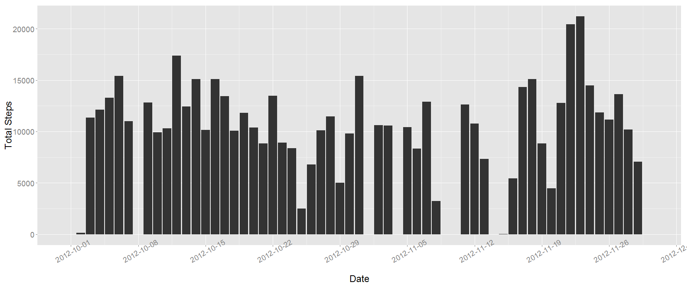
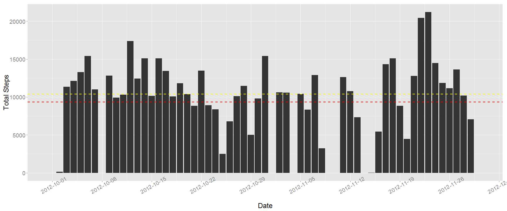
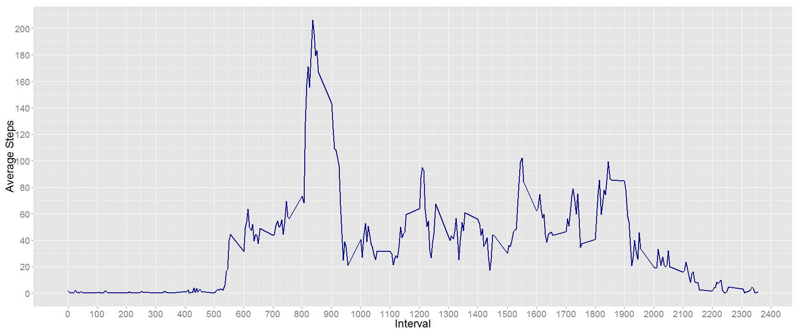
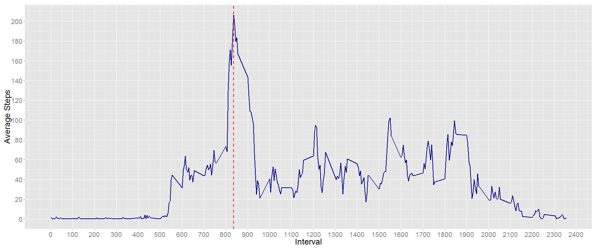
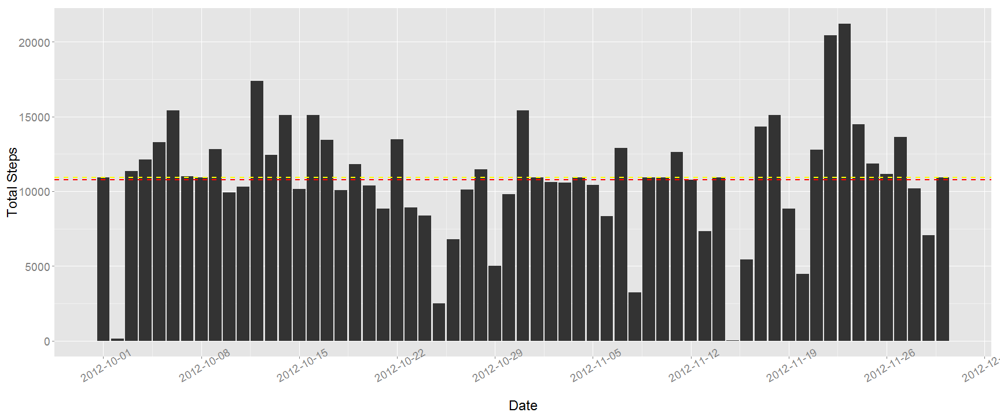
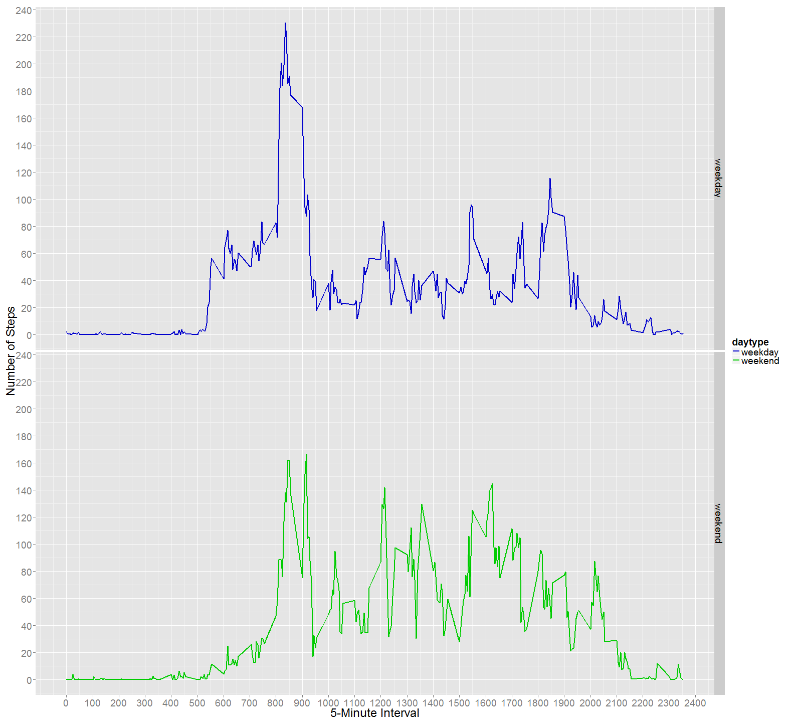

# Reproducible Research: Peer Assessment 1


```r
# set global chunk options: images will be 24x10 inches
knitr::opts_chunk$set(cache=FALSE, echo=TRUE, message=FALSE, fig.width=24, fig.height=10)
```


```r
# Load required libraries
library(scales)
library(plyr)
library(ggplot2)
```


## Loading and preprocessing the data


```r
# Set working directoy here for csv file loading
adata <- read.csv("Y:\\Github\\RepData_PeerAssessment1\\activity.csv", stringsAsFactors = FALSE)
adata$date <- as.Date(adata$date)
head(adata)
```

```
##   steps       date interval
## 1    NA 2012-10-01        0
## 2    NA 2012-10-01        5
## 3    NA 2012-10-01       10
## 4    NA 2012-10-01       15
## 5    NA 2012-10-01       20
## 6    NA 2012-10-01       25
```


## What is mean total number of steps taken per day?


```r
mdata <- ddply(adata,"date", summarize, Sum.Steps = sum(steps, na.rm=T))
str(mdata)
```

```
## 'data.frame':	61 obs. of  2 variables:
##  $ date     : Date, format: "2012-10-01" "2012-10-02" ...
##  $ Sum.Steps: int  0 126 11352 12116 13294 15420 11015 0 12811 9900 ...
```

```r
head(mdata)
```

```
##         date Sum.Steps
## 1 2012-10-01         0
## 2 2012-10-02       126
## 3 2012-10-03     11352
## 4 2012-10-04     12116
## 5 2012-10-05     13294
## 6 2012-10-06     15420
```

```r
p1 <- ggplot(mdata, aes(x=date, y=Sum.Steps)) + 
        geom_bar(stat="identity")+
        xlab("Date")+
        ylab("Total Steps")+
        scale_x_date(labels = date_format("%Y-%m-%d"), breaks="week")+
        theme(text = element_text(size=24),
        axis.text.x = element_text(angle=30, vjust=1)) 
print(p1)
```

 

```r
Mean.Total.Steps <- round(mean(mdata$Sum.Steps),2)
Median.Total.Steps <- round(median(mdata$Sum.Steps),2)
```

The mean total number of steps taken per day is : **9354.23**

The median total number of steps taken per day is : **10395.00**
(as shown on the graph below, red line for mean and yellow for median).


```r
p1 <- p1 + geom_hline(aes(yintercept=Mean.Total.Steps),colour="red", size=1, linetype="dashed") +
  geom_hline(aes(yintercept=Median.Total.Steps),colour="yellow", size=1, linetype="dashed")

print(p1)
```

 


## What is the average daily activity pattern?


```r
ias.data <- ddply(adata,"interval", summarize, Avg.Steps = mean(steps, na.rm=T))
p2 <- ggplot(ias.data, aes(x=interval, y=Avg.Steps))+ 
  geom_line(stat="identity", size=1, colour="darkblue")+
  xlab("Interval")+
  ylab("Average Steps")+
  scale_y_continuous(breaks=seq(0, 250, 20))+
  scale_x_continuous(breaks=seq(0, 2500, 100))+
  theme(text = element_text(size=24)) 

print(p2)
```

 

```r
Max.Steps <- max(ias.data$Avg.Steps)
Max.Step.Int <- ias.data$interval[ias.data$Avg.Steps == Max.Steps]
```

###### The 5-minute interval, on average across all the days in the dataset, which contains the maximum number of steps is: **835**, as shown in red on the graph below.


```r
p2 <- p2 + geom_vline(aes(xintercept=Max.Step.Int),colour="red", size=1, linetype="dashed")
print(p2)
```

 


## Imputing missing values


```r
NA.Steps <- sum(is.na(adata$steps))
```
The total number of missing values in the dataset is: **2304**

###### The chosen strategy for filling in all of the missing values in the dataset, is to use the mean for that 5-minute interval rounded to the immediate geatest integer.


```r
# Creating a new dataset that is equal to the original dataset but with the missing data filled in
fmean <- function(x) {
  x <- replace(x, which(is.na(x)), ceiling(mean(x, na.rm = T)))
  return(x)
}

fdata <- ddply(adata, "interval", transform, steps = fmean(steps))
odata <- fdata[with(fdata, order(date,interval)),]
row.names(odata) <- row.names(adata)

# Original data with missing values
head(adata)
```

```
##   steps       date interval
## 1    NA 2012-10-01        0
## 2    NA 2012-10-01        5
## 3    NA 2012-10-01       10
## 4    NA 2012-10-01       15
## 5    NA 2012-10-01       20
## 6    NA 2012-10-01       25
```

```r
# Data updated after imputing for missing values
head(odata)
```

```
##   steps       date interval
## 1     2 2012-10-01        0
## 2     1 2012-10-01        5
## 3     1 2012-10-01       10
## 4     1 2012-10-01       15
## 5     1 2012-10-01       20
## 6     3 2012-10-01       25
```

```r
codata <- ddply(odata,"date", summarize, Sum.Steps = sum(steps, na.rm=T))
Co.Mean.Total.Steps <- round(mean(codata$Sum.Steps),2)
Co.Median.Total.Steps <- round(median(codata$Sum.Steps),2)
```

The new mean total number of steps taken per day is : **10784.92**
and the new median total number of steps taken per day is : **10909.00**
(both are shown on the graph below, the mean in red and the median in yellow).

These mean and median values differ slightly from the estimates from the first part of the assignment: **9354.23** vs **10784.92** and **10395.00** vs **10909.00**, respectively.

###### Imputing missing data on the estimates of the total daily number of steps, helps correct any errors in data spread due to missing values. As can be seen here, both mean and median values are very close after imputing missing data.


```r
p3 <- ggplot(codata, aes(x=date, y=Sum.Steps)) + 
        geom_bar(stat="identity")+
        xlab("Date")+
        ylab("Total Steps")+
        scale_x_date(labels = date_format("%Y-%m-%d"), breaks="week")+ 
        geom_hline(aes(yintercept=Co.Mean.Total.Steps),colour="red", size=1, linetype="dashed")+
        geom_hline(aes(yintercept=Co.Median.Total.Steps),colour="yellow", size=1, linetype="dashed")+
        theme(text = element_text(size=24),
        axis.text.x = element_text(angle=30, vjust=1)) 

print(p3)
```

 


## Are there differences in activity patterns between weekdays and weekends?


```r
fweekday <- function(x) {
        ifelse (weekdays(as.Date(x)) %in% c("Saturday","Sunday"), 1, 0)
}

odata <- mutate(odata, daytype = factor(fweekday(date), levels=c(0,1), labels=c("weekday","weekend")))
head(odata)
```

```
##   steps       date interval daytype
## 1     2 2012-10-01        0 weekday
## 2     1 2012-10-01        5 weekday
## 3     1 2012-10-01       10 weekday
## 4     1 2012-10-01       15 weekday
## 5     1 2012-10-01       20 weekday
## 6     3 2012-10-01       25 weekday
```

```r
modata <- ddply(odata, c("daytype", "interval"), summarize, mean.steps = mean(steps, na.rm=T))
head(modata)
```

```
##   daytype interval mean.steps
## 1 weekday        0     2.2889
## 2 weekday        5     0.5333
## 3 weekday       10     0.2889
## 4 weekday       15     0.3111
## 5 weekday       20     0.2222
## 6 weekday       25     1.7111
```

```r
p4 <- ggplot(data=modata, mapping=aes(x=interval, y=mean.steps, colour=daytype)) + 
        geom_line(stat="identity", size=1) + 
        facet_grid(daytype ~ .) + 
        labs(x = "5-Minute Interval", y = "Number of Steps") + 
        scale_y_continuous(breaks=seq(0, 250, 20))+
        scale_x_continuous(breaks=seq(0, 2500, 100))+
        scale_colour_manual(values=c("#0000CC", "#00CC00"))+
        theme(text = element_text(size=24)) 

print(p4)
```

 

